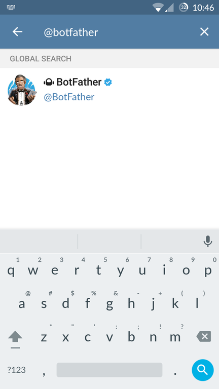
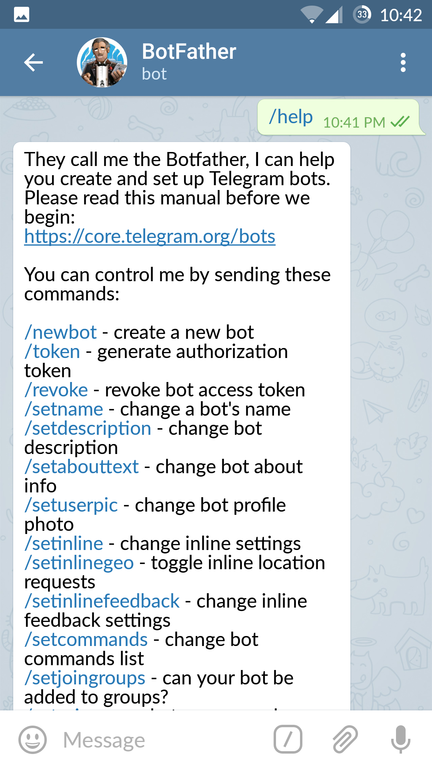
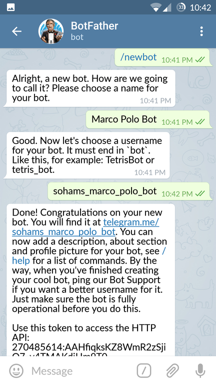

### How to get Telegram bot API token

Simple way of creatign a `bot` on `Telegram`. 

### Set up your Telegram bot

Open the Telegram app on your device complete these 4 steps:

*Step 1.* Find telegram bot named `@botfarther`, he will help you with creating and managing your bot.

 

*Step 2.* Type `/help` and you will see all possible commands that the botfather can operate.

*Step 3.* To create a new bot type `/newbot` or click on it.

Follow instructions he given and create a new name to your bot. If you are making a bot only for experimentation, as it has to be a unique name, you can use namespace your bot by placing your name before it in its username. By the way, its screen name can be anything you like.

*Step 4.* You've just created your Telegram bot. You will see a new API token generated for it.
In sample above it's `270485614:AAHfiqksKZ8WmR2zSjiQ7_v4TMAKdiHm9T0`

Copy your API token and send to your developer